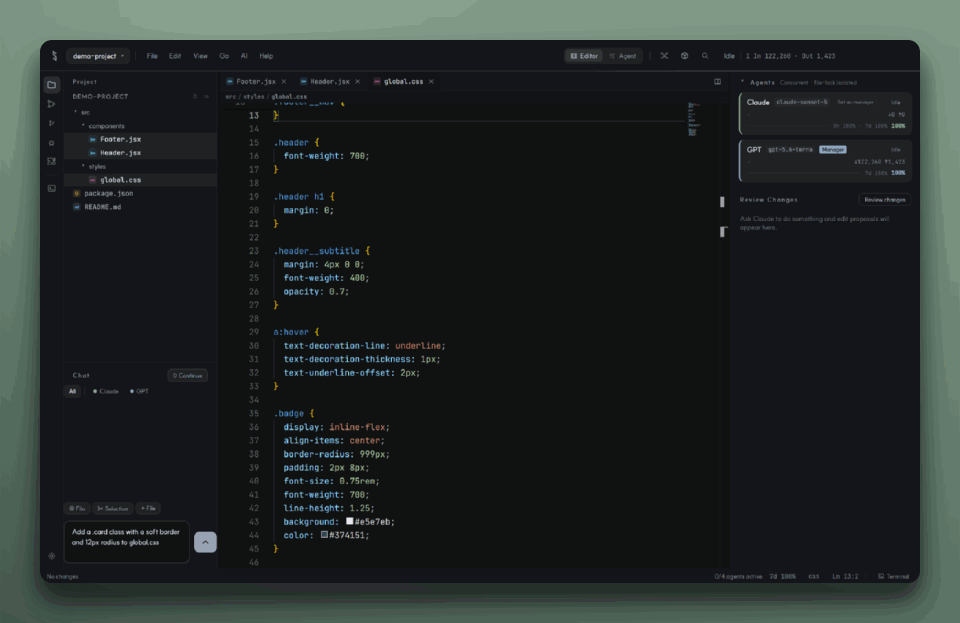

<p align="center">
  
</p>

<h1 align="center">Schutz</h1>

<p align="center">
  <strong>Die KI schreibt. Du entscheidest.</strong>
</p>

<p align="center">
  <a href="https://github.com/SchutzScript/Schutz/releases"></a>
  <a href="https://github.com/SchutzScript/Schutz/actions/workflows/release.yml"></a>
  <a href="LICENSE"></a>
</p>

---

Most AI coding tools hand you a finished diff and ask you to trust it. Schutz shows you the **process** instead. Tool calls, the agent's plan, and its progress stream into the UI live; the edit itself is then replayed into the editor line by line, so you see exactly what changed and where. The goal is to make an AI's edits **observable, beautiful, and controllable**.

<p align="center">
  
</p>

<p align="center">
  <sub>One prompt, and the edit arrives as a diff you can accept or reject — line by line.</sub>
</p>

## The four pillars

| | |
|---|---|
| **Edit animation** | Code streams in as if typed, with a glow on the lines that changed |
| **Diff visualization** | A clear diff of what changed and why, with per-line accept and reject |
| **Agent status & plan** | A live panel showing what the agent is doing now and what comes next |
| **Multi-file view** | An overview that keeps the whole change in frame when several files move at once |

## Install

Download the latest build from the [Releases page](https://github.com/SchutzScript/Schutz/releases).

| Platform | Download |
|---|---|
| Windows | `SchutzSetup-<version>.exe` installer |
| macOS | `.dmg` (Intel and Apple Silicon) |
| Linux | `.AppImage` or `.deb` |

### A note on the Windows warning

The installer is not code-signed yet, so Windows SmartScreen shows **"Windows protected your PC / unknown publisher."** This is expected for an unsigned app, not a sign of anything wrong. To proceed: click **More info**, then **Run anyway**. Signing is planned; until then the warning builds down as more people run the app.

## Quick start

1. **Run the setup wizard.** On first launch Schutz asks for a theme, code and UI fonts, a keymap (VS Code, Vim, or IntelliJ), and an autonomy policy. These apply immediately and can be changed later in Settings.
2. **Connect an AI account.** Open Settings (`⚙`) and sign in with Claude or Codex.
3. **Open a project folder**, then start a chat. Attach a file with `@` or the current selection with `✂` to give the agent context.
4. **Watch the edit land.** Proposals arrive as diffs you accept or reject per line — or apply automatically, depending on your autonomy policy.
5. **Edit inline.** Select code, press `Ctrl+K`, and describe the change to get a proposal scoped to just that range.

The spotlight tour covers the rest, and can be replayed any time from the Help menu.

### Keyboard essentials

| Shortcut | Action |
|---|---|
| `Ctrl+K` | Inline edit on the current selection |
| `Ctrl+P` | Quick open a file |
| `Ctrl+Shift+P` | Command palette |
| `Ctrl+Shift+F` | Search across the project |
| `Ctrl+T` | Search workspace symbols |
| `Ctrl+F5` | Run the file you are looking at |
| `Alt+←` / `Alt+→` | Back and forward through edit locations |
| `Ctrl+W` / `Ctrl+Shift+T` | Close a tab, reopen the last closed one |
| `Ctrl+B` | Hide the sidebar |
| `Ctrl+Shift+M` | Switch between editor and agent mode |

Every binding is editable in Settings → Keybindings, and the list there is generated from the
same table the app dispatches from, so it cannot drift from what actually happens.

## Features

**Editor** — Tabbed editing with 1/2/4 split groups, unsaved-changes guards, project-wide search and replace, TypeScript intelligence, a problems panel, command palette, and symbol outline. Additional languages are supported through LSP (Python via pyright, plus a bridge for custom servers) with formatting, code actions, folding, highlights, and inlay hints. `Alt+←` and `Alt+→` walk back and forward through where you have been — the position, not just the file.

**Run a file** — `Ctrl+F5` runs whatever you are looking at: Python, C, C++, Rust, Go, Node, TypeScript, Ruby, Java, shell. It runs in a real terminal rather than an output panel, so `input()` works and `Ctrl+C` stops it. A missing toolchain is reported as a missing toolchain instead of a shell error, and the per-language command is editable in Settings.

**AI** — Claude and Codex accounts, chat with file and selection context, inline edit, per-project conversation history, and per-agent stop control. The autonomy policy decides which low-risk changes apply on their own and which wait for review. Every run is checkpointed, so you can undo everything one turn touched — and a file you edited afterwards is reported, never silently overwritten. Subagents defined in `.claude/agents` become delegation targets with their own instructions and tool limits.

**Git** — Stage, commit, and push from the source control panel; side-by-side diff against `HEAD`; gutter change markers; branch and ahead/behind status; blame and stash. The file tree colours what changed, so you can see it without opening the panel.

**Terminal** — A real PTY terminal (xterm.js + node-pty) with ANSI color, scrollback, and multiple tabs, alongside a log tab showing live agent activity.

**MCP** — A built-in Model Context Protocol host, speaking revision 2025-06-18 and falling back to whatever a server negotiates. Import existing servers, generate one from a program, or drop an `.mcpb` bundle onto the window — the install dialog shows the exact command before anything runs. Tools, resources and prompts are all read; tools are exposed to the agent loop.

**Debugging** — Breakpoints, call stack, variables, and stepping via DAP (Python/debugpy today).

**Extensions** — Install VS Code extensions from Open VSX, with TextMate grammars and icon themes. The `vscode` shim gives them the active editor for real: reading the document, moving the selection, and editing through the model so `Ctrl+Z` still works. Extensions can ask you things too — quick picks, input boxes with validation, and messages with buttons, each labelled with the extension doing the asking. Diagnostics land in the editor and the problems panel; definitions and formatters work; settings, file watchers and status bar items all do what they say. Trees and webviews contributed by an extension get their own place in the sidebar, webviews sandboxed. Quick fixes appear in the editor's own menu and apply through the model, so one `Ctrl+Z` takes them back. Schutz-native extensions can register commands, show panels, and subscribe to what happens in the IDE — files opened and saved, proposals accepted or rejected, agent turns starting and ending.

**Localization** — The full UI ships in Korean, English, German, and Japanese.

## Design principles

- **Provider-agnostic** — Claude, OpenAI, Grok, and GLM today, behind a swappable adapter
- **Observable by default** — every AI action surfaces in the UI
- **Human-in-the-loop** — every change can be accepted, rejected, or reverted
- **Progressive fidelity** — validate the experience first, then deepen it at the editor core

## Build from source

The desktop app lives in [`ide/`](ide) and needs Node.js 20 or newer.

```bash
cd ide
npm install
npm run dev        # Vite dev server (renderer only)
npm run electron   # run the Electron app
npm run dist:win   # Windows installer (Inno Setup)
npm run dist:mac   # macOS build
npm run dist:linux # Linux build
```

## Roadmap

- **Phase 1** — validate the core experience *(done)*
- **Phase 2** — deepen renderer-level visual effects at the editor core *(in progress)*
- **Phase 3** — more providers (Gemini, local/OpenAI-compatible endpoints) and codebase indexing

The ecosystem work that used to sit in Phase 3 has shipped: VS Code extensions, Claude Code
skills and subagents, MCP servers over stdio and HTTP, and `.mcpb` bundles are all in the app
today. A VS Code extension can read and edit the active document, publish diagnostics, ask
you a question, read its own settings, watch files, show status, and contribute a tree or
webview to the sidebar. MCP speaks all three of its pillars rather than tools alone.

MCP resources and prompts are offered to the agent, not just listed in a panel.

Where it is still thin, specifically: a `WorkspaceEdit` cannot create, delete or rename
files, and the shim has no `TextEditor` decorations, no custom editors, and no debug adapter
API. Each of those throws rather than returning an empty value, so an extension that needs
one fails loudly instead of quietly doing nothing.

## Contributing

Issues and pull requests are welcome. CI runs on every push and pull request: `npm run typecheck`,
`npm test`, and `npm run build` in `ide/`. Running those three locally before opening a PR gets you
the same answer without the wait.

Note that `typecheck` is two passes — the whole app, then the stricter island under `src/engine`,
which turns on `strict` and `noUncheckedIndexedAccess` for code that is meant to be provably total.

See [CHANGELOG.md](CHANGELOG.md) for release history and [docs/DESIGN.md](docs/DESIGN.md) for design notes.

## License

**FSL-1.1-Apache-2.0** (Functional Source License) — see [LICENSE](LICENSE).

The source is public: you may use, modify, and contribute to it freely. Use in a commercial product or service that competes with Schutz is restricted for two years; two years after publication, each version converts automatically to Apache 2.0.
